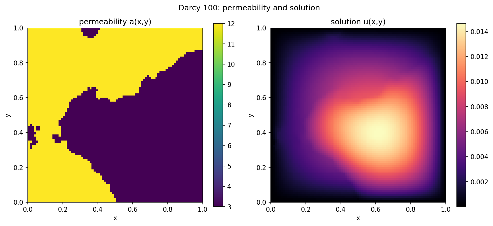
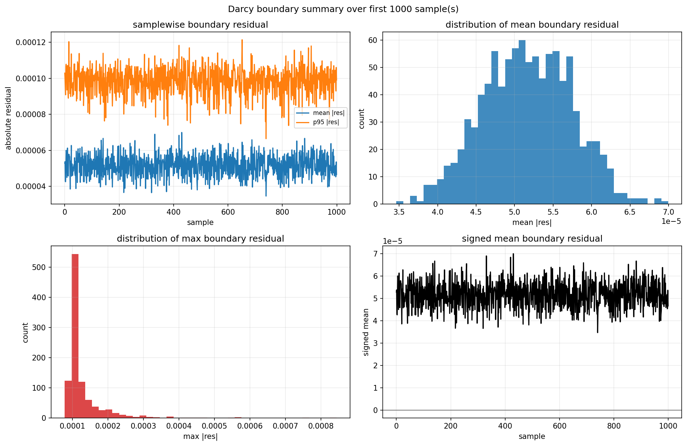

# Darcy Benchmark



This benchmark is a steady elliptic operator-learning task on a structured
Cartesian grid. The input is the scalar permeability field `a(x, y)` and the
target is the scalar pressure field `u(x, y)`, linked by Darcy's law:

$$
-\nabla \cdot (a \nabla u) = f
$$

In the current benchmark slice used in this repo, the forcing is treated as a
fixed constant source with

$$
f(x, y) = 1
$$

on the unit square domain $\Omega = [0, 1]^2$, together with homogeneous
Dirichlet boundary data:
$$
u|_{\partial \Omega} = 0
$$

The default benchmark metadata lives in
[`configs/benchmarks/darcy/base.yaml`](/Users/bruno/Documents/Y4/FYP/omni_hc/configs/benchmarks/darcy/base.yaml).


## Dataset Diagnostics



The Darcy data lives on a structured unit-square grid, so the meaningful
boundary is the box `x = {0,1}` and `y = {0,1}`.

The boundary diagnostic above supports the current hard-constraint choices:
- the target pressure is effectively zero on all four box edges
- the benchmark is therefore consistent with a homogeneous Dirichlet ansatz
- the forcing assumption used by the flux constraint is the constant source
  `f = 1`, so the recovered flux should satisfy `div(v) = 1`

## Hard Constraints

The Darcy benchmark currently has two hard-constraint variants:
- [DirichletBoundaryAnsatz](../constraints/boundary/DirichletBoundaryAnsatz.md):
  direct architectural ansatz for exact zero pressure on the box boundary.
- [DarcyFluxConstraint](../constraints/stream/DarcyFluxConstraint.md):
  flux-based pressure recovery that hard-builds the continuity equation
  `div(v) = 1` before solving back for pressure.

The corresponding experiment configs live under
[`configs/experiments/darcy/`](/Users/bruno/Documents/Y4/FYP/omni_hc/configs/experiments/darcy),
and they can all be run through the shared commands documented in
[../README.md](../README.md).

## Experiment Configs

Available Darcy experiment configs:

- [`configs/experiments/darcy/fno_small.yaml`](/Users/bruno/Documents/Y4/FYP/omni_hc/configs/experiments/darcy/fno_small.yaml)
- [`configs/experiments/darcy/fno_small_dirichlet.yaml`](/Users/bruno/Documents/Y4/FYP/omni_hc/configs/experiments/darcy/fno_small_dirichlet.yaml)
- [`configs/experiments/darcy/fno_small_flux_fft_pad.yaml`](/Users/bruno/Documents/Y4/FYP/omni_hc/configs/experiments/darcy/fno_small_flux_fft_pad.yaml)
- [`configs/experiments/darcy/gt_small_flux_fft_pad.yaml`](/Users/bruno/Documents/Y4/FYP/omni_hc/configs/experiments/darcy/gt_small_flux_fft_pad.yaml)

Use the shared run commands from [../README.md](../README.md) with any of these
configs.

## Dataset Checks

Inspect the observed boundary values with:

```bash
python scripts/diagnostics/darcy/darcy_boundary.py \
  --samples 0 10 100 \
  --summary-samples 1000
```

That script produces per-sample plots and the dataset summary figure shown
above.

The current benchmark assumptions implied by the docs and constraints are:

- pressure is zero on the full box boundary
- permeability is the single input channel
- pressure is the single output channel
- the domain is the unit square
- the flux-form residual is built around the constant source term `f = 1`
