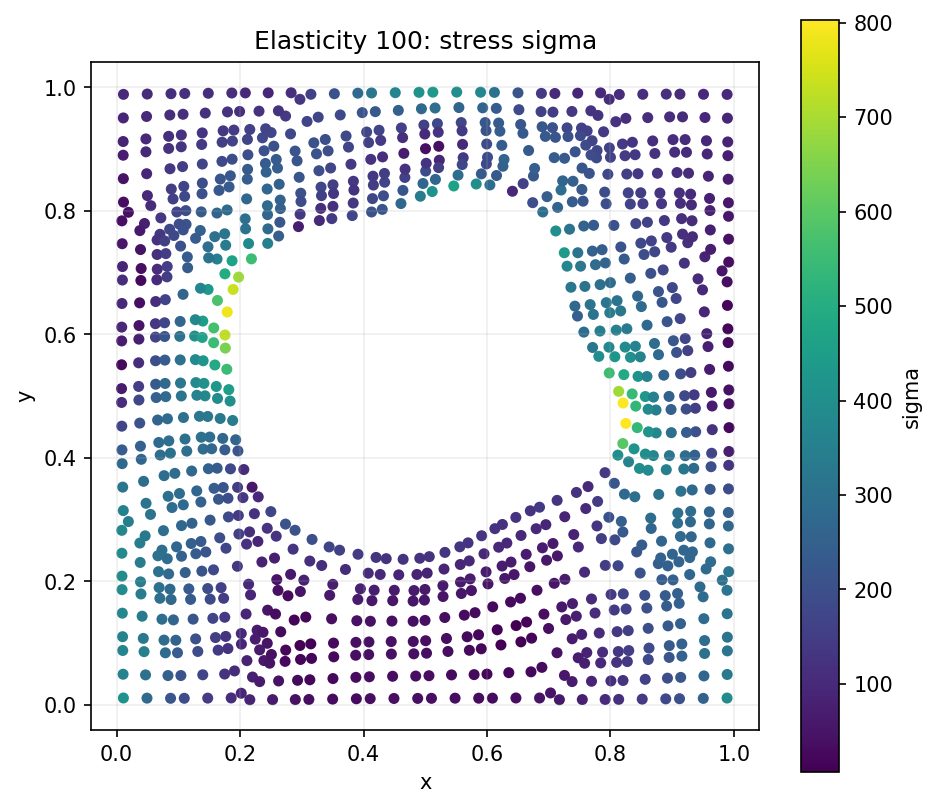

# Elasticity Benchmark


This benchmark predicts stress on an unstructured 2D
point cloud for an incompressible hyperelastic material (specifically, Rivlin-Saunders) on a 2D unit cell with an arbitrarily shaped void in the center. 

We only use:
- `Meshes/Random_UnitCell_XY_10.npy`: point coordinates, interpreted as
  `(samples, points, 2)`.
- `Meshes/Random_UnitCell_sigma_10.npy`: scalar stress target, interpreted as
  `(samples, points, 1)`.

The default point-cloud setup therefore predicts one scalar `sigma` per material
point from the 2D point coordinates.

The benchmark defaults live in
[`configs/benchmarks/elasticity/base.yaml`](/Users/bruno/Documents/Y4/FYP/omni_hc/configs/benchmarks/elasticity/base.yaml).

## Hard Constraints

The first documented hard-constraint variant is:

- [ElasticityPlaneStressVMConstraint](../constraints/elasticity/ElasticityPlaneStressVMConstraint.md):
  maps two latent channels, the mean and deviatoric in-plane log stretches
  $(m,d)$, to three incompressible principal stretches, enforces
  $\sigma_3=0$, and returns the plane-stress von Mises stress.

The corresponding experiment config is
[`configs/experiments/elasticity/fno_small_plane_stress_vm.yaml`](/Users/bruno/Documents/Y4/FYP/omni_hc/configs/experiments/elasticity/fno_small_plane_stress_vm.yaml).

## Dataset Checks

Inspect the NSL-style tensor layout with:

```bash
python scripts/diagnostics/elasticity/elasticity_loader_check.py
```

For sample plots and scalar stress summaries:

```bash
python scripts/diagnostics/elasticity/elasticity_dataset_summary.py \
  --samples 0 10 100 \
  --summary-samples 1000
```

For a file-by-file analysis of all four dataset representations, see the
[elasticity dataset inventory](elasticity_data_inventory.md). Reproduce its
figures and CSV summary with:

```bash
conda run -n omni-hc python \
  scripts/diagnostics/elasticity/elasticity_data_inventory.py
```
