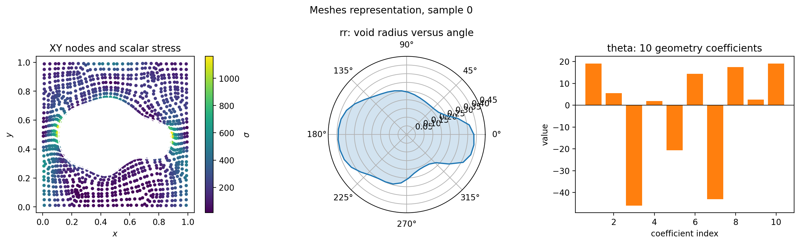
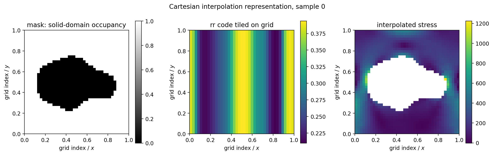
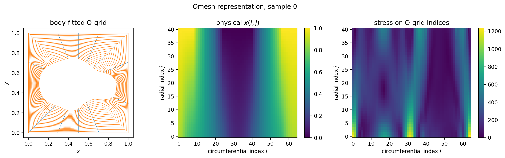
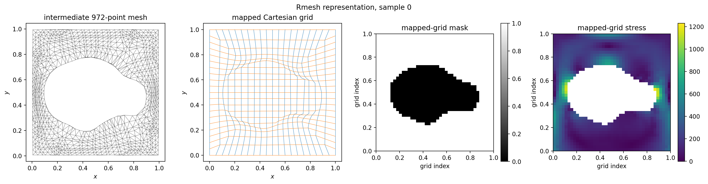

# Elasticity Dataset Inventory

The directory `data/elasticity` contains 15 NumPy arrays describing the same
2,000 random unit-cell geometries in four different discretizations. Only the
`Meshes/XY` and `Meshes/sigma` arrays are used by the current OmniHC benchmark.

The labels below distinguish facts verified from the upstream Geo-FNO code from
interpretations inferred from array structure and numerical relationships.

## Original Meshes

| File | Shape | Meaning | Confidence |
|---|---:|---|---|
| `Meshes/Random_UnitCell_XY_10.npy` | `(972, 2, 2000)` | Geometry-specific physical coordinates of the 972 unstructured FEM/point-cloud nodes. | Verified: loaded upstream as `mesh`. |
| `Meshes/Random_UnitCell_sigma_10.npy` | `(972, 2000)` | One scalar stress value at every node. The raw values are strictly positive. We treat this as von Mises stress, but the array itself contains no tensor components with which to recompute the invariant. | Verified as scalar stress; von Mises interpretation comes from external provenance. |
| `Meshes/Random_UnitCell_rr_10.npy` | `(42, 2000)` | Periodic samples of the central void radius as a function of polar angle. Samples 0 and 41 are identical. | Strong numerical evidence: its minimum matches the nearest mesh radius with correlation `0.996`. Loaded upstream as the 42-component geometry `code`. |
| `Meshes/Random_UnitCell_theta_10.npy` | `(2000, 10)` | Ten random coefficients used to generate the void boundary. They correspond closely to the cosine/sine coefficients of the first five Fourier modes of `rr`; the exact generation scaling is not included. | Strong inference from correlations between `theta` and the Fourier coefficients of `rr`. |

`XY` is the physical domain supplied to the current point-cloud models. `rr`
and `theta` are geometry descriptions, not strain, displacement, or material
orientation. In particular, this dataset field named `theta` is unrelated to
the principal-stretch orientation angle used by the discarded elasticity
constraint.



## Cartesian Interpolation

| File | Shape | Meaning | Confidence |
|---|---:|---|---|
| `Interp/Random_UnitCell_mask_10_interp.npy` | `(41, 41, 2000)` | Binary occupancy of the material on a uniform Cartesian grid: one in the solid and zero in the void. The upstream interpolation FNO uses this as its only data input and multiplies its output by the same mask. | Verified from upstream code and geometry. |
| `Interp/Random_UnitCell_rr_10_interp.npy` | `(41, 41, 2000)` | A 41-sample resampling of the periodic `rr` boundary code, repeated unchanged along the second grid axis. It is an encoded global geometry input, not a spatial radius field. | Verified numerically; its intended upstream model is not documented. |
| `Interp/Random_UnitCell_sigma_10_interp.npy` | `(41, 41, 2000)` | Scalar stress interpolated from the unstructured mesh onto the uniform Cartesian grid, with zeros in the void. Cubic/interpolation overshoot creates a small number of negative values down to about `-30`; these are not present in the original stress. | Verified from upstream interpolation FNO usage and numerical range. |



## Omesh

| File | Shape | Meaning | Confidence |
|---|---:|---|---|
| `Omesh/Random_UnitCell_Deform_X_10_interp.npy` | `(65, 41, 2000)` | Physical x-coordinate of a body-fitted structured O-grid. Index 0 is circumferential and periodic; index 1 runs from the void boundary to the outer square. | Verified from topology and upstream Omesh model usage. |
| `Omesh/Random_UnitCell_Deform_Y_10_interp.npy` | `(65, 41, 2000)` | Physical y-coordinate of the same O-grid. | Verified. |
| `Omesh/Random_UnitCell_Deform_sigma_10_interp.npy` | `(65, 41, 2000)` | Scalar stress interpolated onto the O-grid. | Verified as the Omesh target. |

Here, `Deform` means a coordinate deformation between a regular computational
index grid and the irregular physical unit-cell geometry. It is not the
mechanical displacement caused by loading.



## Rmesh

| File | Shape | Meaning | Confidence |
|---|---:|---|---|
| `Rmesh/Random_UnitCell_Deform_Grid_XY_10_interp.npy` | `(972, 2, 2000)` | An intermediate geometry-specific 972-point remesh. It is not nodewise displacement from `Meshes/XY`: same array indices do not preserve material-point identity. | Strong inference from geometry and lack of pointwise correspondence. |
| `Rmesh/Random_UnitCell_Deform_Grid_X_10_interp.npy` | `(41, 41, 2000)` | Physical x-coordinate of a mapped 41 by 41 grid. The upstream Dmesh model uses it as an input channel. | Verified from upstream code. |
| `Rmesh/Random_UnitCell_Deform_Grid_Y_10_interp.npy` | `(41, 41, 2000)` | Physical y-coordinate of the mapped grid. | Verified from upstream code. |
| `Rmesh/Random_UnitCell_Deform_Grid_mask_10_interp.npy` | `(41, 41, 2000)` | Boolean solid-domain mask on the mapped grid. | Verified from upstream code. |
| `Rmesh/Random_UnitCell_Deform_Grid_sigma_10_interp.npy` | `(41, 41, 2000)` | Scalar stress interpolated onto the mapped grid. | Verified as the Dmesh target. |



## Implications for Physical Constraints

These arrays do not add displacement, deformation-gradient, or stress-tensor
supervision. Therefore they cannot directly enforce equilibrium,
compatibility, incompressibility, or the von Mises definition.

They do provide useful geometric structure:

1. `rr` or `theta` can condition a global latent deformation/stress decoder,
   instead of asking every point to infer the whole void geometry from `(x,y)`.
2. The O-grid supplies a consistent neighbourhood topology. It enables a
   U-Net/FNO decoder and finite differences along radial and circumferential
   directions.
3. The masks provide exact material support, so stress can be forced to zero
   outside the body and losses can exclude interpolation artefacts in the void.
4. The physical coordinate maps supply metric/Jacobian factors needed to
   transform derivatives from the structured computational grid to physical
   coordinates.

The fourth option is the most physically meaningful extension. A structured
decoder could predict a displacement or stress-potential field on the O-grid,
use the coordinate-map Jacobian to evaluate physical derivatives, and then
enforce compatibility or equilibrium. That would be a new constraint with
actual global coupling, rather than another pointwise stress
reparameterization.

## Reproduction

Run:

```bash
conda run -n omni-hc python \
  scripts/diagnostics/elasticity/elasticity_data_inventory.py
```

This writes the figures above and
`artifacts/elasticity/elasticity_npy_inventory.csv`.

Upstream references:

- [Geo-FNO repository](https://github.com/neuraloperator/Geo-FNO)
- [Geo-FNO elasticity example](https://github.com/neuraloperator/Geo-FNO/blob/main/elasticity/elas_geofno.py)
- [Cartesian interpolation FNO](https://github.com/neuraloperator/Geo-FNO/blob/main/elasticity/elas_interp_fno.py)
- [Geo-FNO paper](https://arxiv.org/abs/2207.05209)
