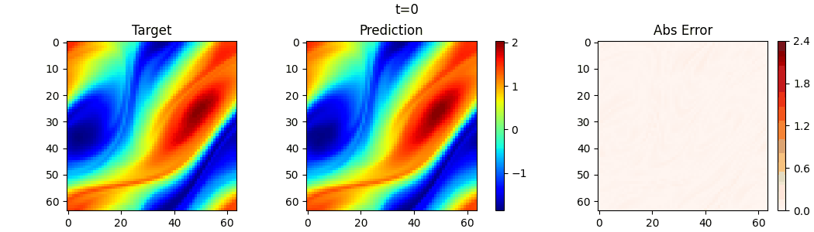
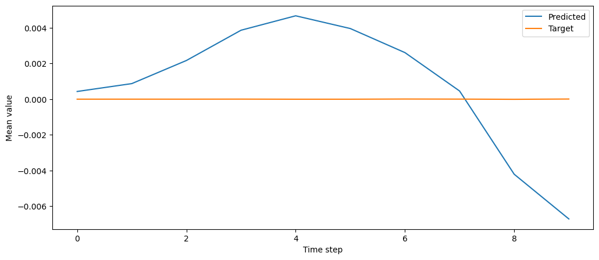

# Navier-Stokes Benchmark

This benchmark is an autoregressive vorticity prediction task on a periodic 2D incompressible Navier-Stokes dataset. The runtime adapter is selected by `benchmark.name: navier_stokes_2d`, and the default dataset/config metadata
live in
[`configs/benchmarks/navier_stokes/base.yaml`](/Users/bruno/Documents/Y4/FYP/omni_hc/configs/benchmarks/navier_stokes/base.yaml).

## Physics

The model predicts vorticity `w(x, y)`. Because the domain is periodic, the global vorticity mean should stay fixed over time. 
An unconstrained model can fit the rollout well while still drifting in the global vorticity. See the corresponding [Mean Constraint](../constraints/mean/MeanConstraint.md).

## Runnable Configs

Available Navier-Stokes experiment configs:

- [`configs/experiments/navier_stokes/fno_small_mean.yaml`](/Users/bruno/Documents/Y4/FYP/omni_hc/configs/experiments/navier_stokes/fno_small_mean.yaml)
- [`configs/experiments/navier_stokes/gt_small_mean.yaml`](/Users/bruno/Documents/Y4/FYP/omni_hc/configs/experiments/navier_stokes/gt_small_mean.yaml)

Use the shared run commands from [../README.md](../README.md) with either of
these configs.
