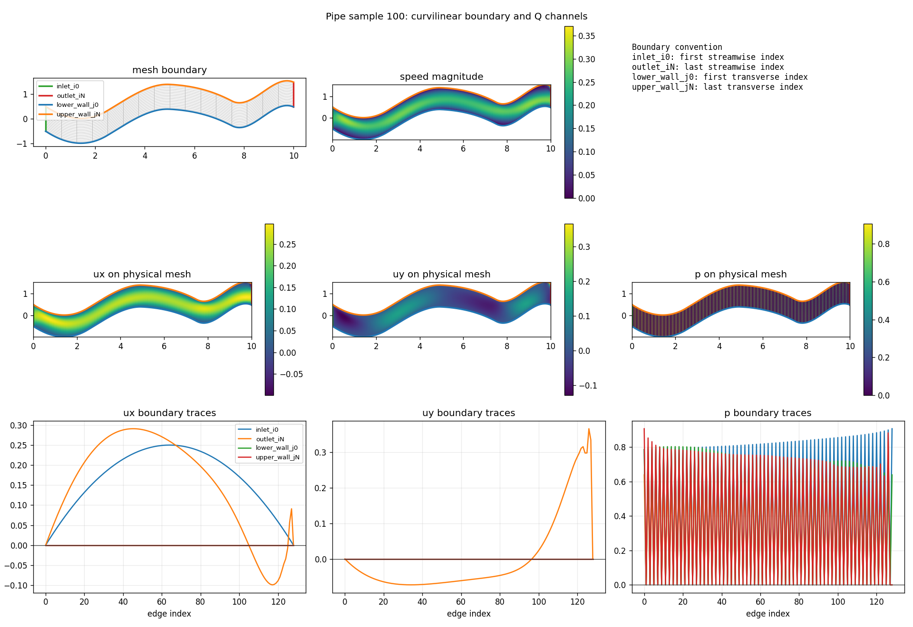
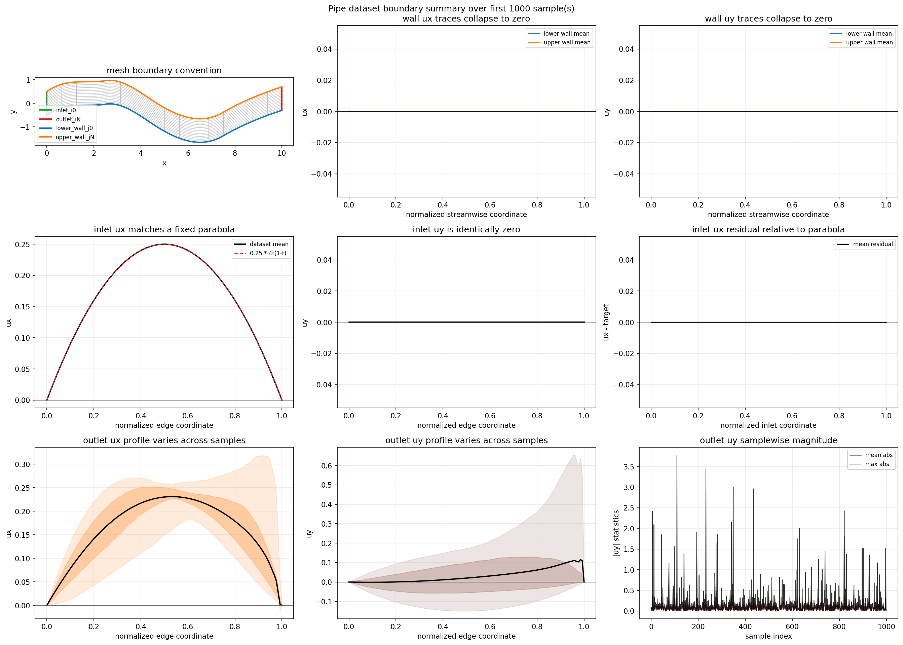
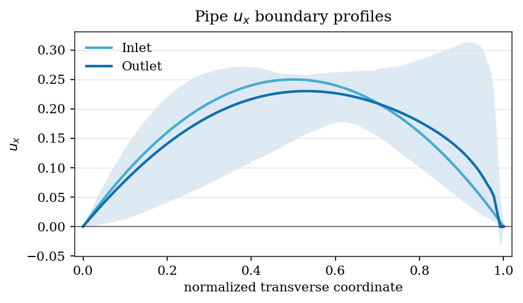
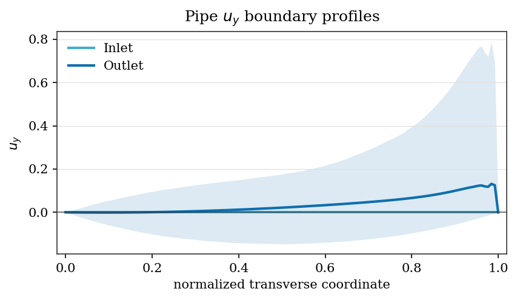

# Pipe Flow Benchmark



This benchmark is a steady internal-flow task on a structured curvilinear pipe
mesh. The input is the two-channel coordinate field and the raw dataset target
contains three output channels:

- `Pipe_Q[..., 0]`: $u_x$
- `Pipe_Q[..., 1]`: $u_y$
- `Pipe_Q[..., 2]`: $p$

The default setup from the original benchmark uses `target_channel: 0`, so the main
pipe experiments in this repo focus on $u_x$.

The physical pipe-flow target is still a two-component incompressible velocity
field plus pressure. For the full velocity field, incompressibility requires the
divergence-free constraint

$$
\nabla \cdot \mathbf{u}
= \frac{\partial u_x}{\partial x} + \frac{\partial u_y}{\partial y}
= 0.
$$

This matters when interpreting scalar $u_x$ experiments: a model trained only
against $u_x$ does not directly observe or penalize the dataset's $u_y$ channel.
Stream-function constraints can provide a divergence-free velocity completion
internally, but the training objective still supervises only the returned
$u_x$ unless the benchmark is changed to predict both velocity components or add
an auxiliary loss on $u_y$.

The benchmark defaults live in [`configs/benchmarks/pipe/base.yaml`](../../configs/benchmarks/pipe/base.yaml).

## Dataset Diagnostics



The pipe data is a structured curvilinear mesh. The meaningful boundaries are
therefore the structured-grid index edges rather than fixed Cartesian
thresholds:

- $i=0$: inlet
- $i=H-1$: outlet
- $j=0$: lower wall
- $j=W-1$: upper wall

That distinction matters because some constraints should be expressed in index
space, while others should use decoded physical coordinates from the curvilinear
mesh.

The velocity boundary profiles are therefore shown only for the non-trivial
inlet and outlet edges:





The top and bottom wall profiles are omitted from the plots because the no-slip
condition makes the edge rows flat zero lines. The tables also report the first
interior row next to each wall to show the near-wall scale:


## Hard Constraints

The pipe benchmark currently has five documented hard-constraint variants:

- [StructuredWallDirichletAnsatz](../constraints/boundary/StructuredWallDirichletAnsatz.md):
  wall-only direct-output ansatz for zero wall velocity.
- [PipeInletParabolicAnsatz](../constraints/boundary/PipeInletParabolicAnsatz.md):
  inlet-only direct-output ansatz for scalar $u_x$.
- [PipeUxBoundaryAnsatz](../constraints/boundary/PipeUxBoundaryAnsatz.md):
  combined inlet-plus-wall direct-output ansatz for scalar $u_x$.
- [PipeStreamFunctionUxConstraint](../constraints/stream/PipeStreamFunctionUxConstraint.md):
  stream-function construction that returns $u_x$ from an internally recovered
  divergence-free velocity field. Because the benchmark supervises only $u_x$,
  the recovered $u_y$ is not directly trained against the dataset.
- [PipeStreamFunctionBoundaryAnsatz](../constraints/stream/PipeStreamFunctionBoundaryAnsatz.md):
  divergence-free stream-function construction with hard inlet and wall
  behavior.

The corresponding experiment configs live under
[`configs/experiments/pipe/`](../../configs/experiments/pipe),
and they can all be run through the shared commands documented in
[here](../README.md).

## Dataset Checks

Inspect the observed boundary values with:

```bash
python scripts/diagnostics/pipe/pipe_boundary.py \
  --samples 0 10 100 \
  --summary-samples 1000
```

Inspect the inlet profile with:

```bash
python scripts/diagnostics/pipe/pipe_inlet_profile.py \
  --samples 0 10 100 \
  --summary-samples 1000
```

For a broader dataset summary:

```bash
python scripts/diagnostics/pipe/pipe_dataset_summary.py \
  --summary-samples 1000
```

For a discrete finite-volume divergence check on the curvilinear cells:

```bash
python scripts/diagnostics/pipe/pipe_divergence.py \
  --summary-samples 1000
```

These checks support the current hard-constraint choices:

- both wall components are zero on $j=0$ and $j=W-1$
- inlet $u_x$ follows the fixed parabola $0.25 \cdot 4t(1-t)$
- inlet $u_y$ is zero in the inspected data slice
- outlet values remain sample-dependent
- the dataset is not uniformly pointwise divergence-free under the current
  cell-based finite-volume check: many samples are close, but some show
  localized spikes
