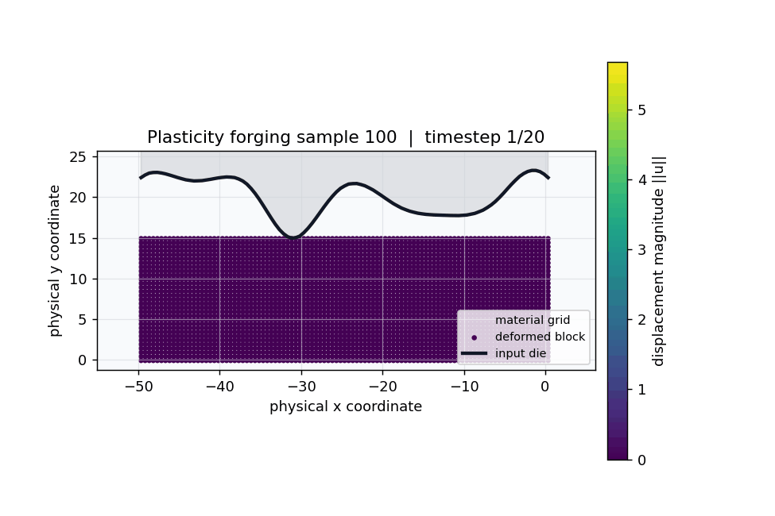

# Plasticity Benchmark



This benchmark predicts plastic forging deformation on astructured 2D mesh. 

The benchmark defaults live in
[`configs/benchmarks/plasticity/base.yaml`](../../configs/benchmarks/plasticity/base.yaml).

## Dataset

The plasticity benchmark uses the following dataset:

- `plas_N987_T20.mat`
- `input`: `(987, 101)`
- `output`: `(987, 101, 31, 20, 4)`

The input is a one-dimensional die profile sampled at 101 points. The NSL
loader broadcasts that profile across the second spatial axis, so each model receives:

- coordinates: `(N, 3131, 2)`
- function input: `(N, 3131, 1)`
- time input: `(N, 20)`
- target: `(N, 3131, 80)`, where `80 = 20 * 4`

At runtime, each model call predicts one timestep:

```text
model(coords, fx, T=t) -> (batch, points, 4)
```

The full prediction used for validation and testing is built by concatenating the 20 time-conditioned outputs:

```text
(batch, points, 4) * 20 -> (batch, points, 80)
```

This is not autoregressive: previous predictions are not fed back into the next step. The time scalar tells the model which deformation state to predict.

## Splits

The upstream NSL StandardBench scripts use:

- `ntrain: 900`
- `ntest: 80`

OmniHC still creates validation data from the training subset. The test subset
is held out as the last 80 samples and should only be used after final model
selection.

## Channel Semantics

The four output channels at each timestep are:

- channel `0`: deformed physical `x` coordinate
- channel `1`: deformed physical `y` coordinate
- channel `2`: displacement component `u_x`
- channel `3`: displacement component `u_y`

The upstream Geo-FNO plasticity visualizer scatters points at channels `0:2` and
colors them by `||channels 2:4||`. Local diagnostics also verify that
`channels 0:2 - channels 2:4` is a nearly fixed material grid over time. For the
first 64 training samples, the final-step mean absolute residual against the
inferred material grid is approximately `6.4e-6` in `x` and `1.7e-6` in `y`.

The material grid is not normalized to `[0, 1]`. It is approximately:

- `x_ref = 0.35 - 0.5 * i`
- `y_ref = 14.9 - 0.5 * j`

With this orientation, `j=0` is the upper die side and `j=30` is the lower
clamped side. The diagnostic reports `u_y = 0` on `lower_jN`.

Use the channel probe to reproduce the check:

```bash
python scripts/studies/plasticity_channel_probe.py \
  --data-dir data/plasticity \
  --summary-samples 64 \
  --samples 0
```

## Metrics And Plots
For mesh visualizations, the unconstrained output has two possible geometry sources:

- direct coordinate channels: `[x, y]`
- displacement-derived coordinates: `[x_ref, y_ref] + [u_x, u_y]`

OmniHC plots their average:

```text
plot_xy = 0.5 * ([x, y] + ([x_ref, y_ref] + [u_x, u_y]))
```

For constrained runs these two sources agree by construction because the
constraint builds the displacement from the reconstructed coordinates.

## Hard Constraints

The documented hard-constraint variant is:

- [PlasticityMeshConsistencyConstraint](../constraints/plasticity/PlasticityMeshConsistencyConstraint.md):
  reconstructs an ordered deformation mesh from positive learned spacings and
  returns the benchmark target channels `[x, y, u_x, u_y]`.

The shared constraint config is
[`configs/constraints/plasticity_mesh_consistency_constraint.yaml`](../../configs/constraints/plasticity_mesh_consistency_constraint.yaml).

The current baseline experiment config is
[`configs/experiments/plasticity/fno.yaml`](../../configs/experiments/plasticity/fno.yaml).

Example unconstrained run:

```bash
python scripts/train.py --benchmark plasticity --backbone FNO --budget debug
```

Example constrained run:

```bash
python scripts/train.py \
  --benchmark plasticity \
  --backbone FNO \
  --constraint plasticity_mesh_consistency \
  --budget debug
```

## Dataset Checks

Generate the forging rollout figure used above with:

```bash
python scripts/diagnostics/plasticity/plasticity_forging_gif.py \
  --data-dir data/plasticity \
  --sample 100
```

Inspect channel consistency with:

```bash
python scripts/studies/plasticity_channel_probe.py \
  --data-dir data/plasticity \
  --summary-samples 64 \
  --samples 0
```
