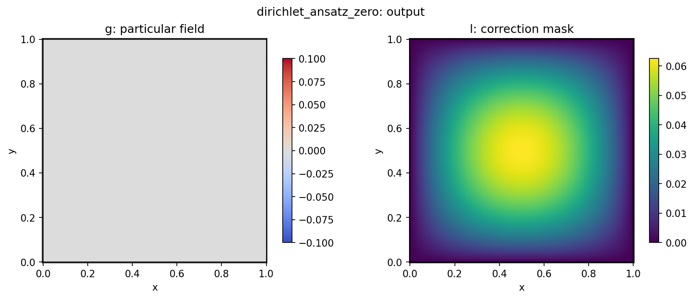

# DirichletBoundaryAnsatz

`DirichletBoundaryAnsatz` enforces a constant Dirichlet value at the box boundaries.
$$f(x) = g + l(x)N(x)$$
where $l(x)$ is a distance metric:
$$ l(x) = Π_i (x_i - \text{lower})(\text{upper} - x_i) $$
## Config

See `configs/constraints/dirichlet_ansatz_zero.yaml`.

## Tests

Covered by `tests/test_boundary.py`.

