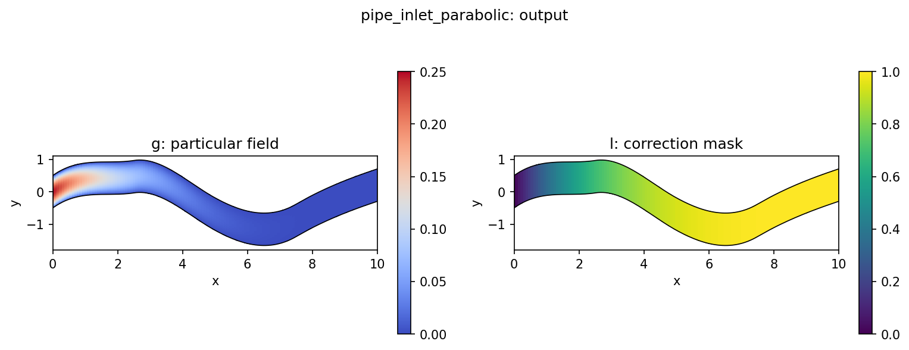
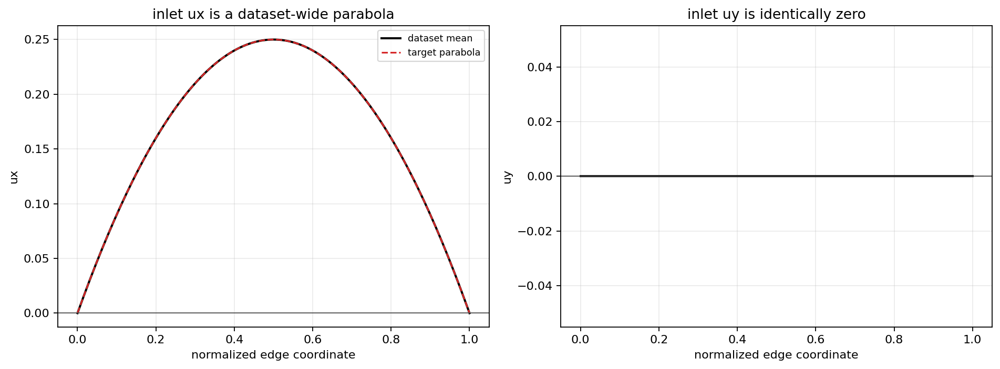

# PipeInletParabolicAnsatz

`PipeInletParabolicAnsatz` enforces the observed inlet profile for scalar pipe
$u_x$ while leaving the interior free to be predicted by the backbone.

## Mechanism



The constraint uses a smooth inlet ansatz:

$$
u = g + l \times N
$$
where 
$$
g(i,j) = \alpha(i) U_{\max} 4t(j)(1-t(j))
$$
and
$$
l(i,j) = 1 - \alpha(i),
\qquad
\alpha(i) = (1-\xi(i))^p
$$

Here $N$ is the unconstrained model output, $U_{\max}$ is the configured
`amplitude`, $\xi$ is the normalized horizontal coordinate, and $t$ is the
normalized physical vertical coordinate on the inlet edge.

At the inlet, $\xi=0$ and therefore $\alpha=1$. This gives $l=0$ and forces the
prediction to the parabolic inlet profile:

$$
u_x(t) = U_{\max} 4t(1-t)
$$

Away from the inlet, $\alpha$ decays and the free model output progressively
takes over.

Unlike the wall ansatz, the inlet profile is computed from decoded physical
coordinates, not just from index position. That matters because the pipe mesh is
curvilinear and the physical $Y$ coordinate varies by sample.

## Pipe Use Case

This constraint is intended for the $u_x$ benchmark used by the pipe experiments. It is not the right constraint for $u_y$ or pressure.

The current inferred inlet profile uses $U_{\max}=0.25$:
$$
u_x(t) = 0.25 \cdot 4t(1-t)
$$

where $t=(y-y_{\min})/(y_{\max}-y_{\min})$ along the inlet edge.

## Dataset Checks

Validate the inlet profile with:

```bash
python scripts/diagnostics/pipe_inlet_profile.py \
  --samples 0 10 100 \
  --summary-samples 1000
```

For a broader dataset summary:

```bash
python scripts/diagnostics/pipe_dataset_summary.py \
  --summary-samples 1000
```

These checks show that inlet $u_x$ follows the fixed parabola above and inlet
$u_y$ remains zero over the inspected dataset slice.

## Config

Shared constraint config:

[`configs/constraints/pipe_inlet_parabolic.yaml`](/Users/bruno/Documents/Y4/FYP/omni_hc/configs/constraints/pipe_inlet_parabolic.yaml)

```yaml
constraint:
  name: "pipe_inlet_parabolic"
  amplitude: 0.25
  inlet_axis: 0
  transverse_axis: 1
  coordinate_channel: 1
  decay_power: 4.0
```

Pipe experiment using this constraint:

[`configs/experiments/pipe/fno_small_inlet.yaml`](/Users/bruno/Documents/Y4/FYP/omni_hc/configs/experiments/pipe/fno_small_inlet.yaml)

## Diagnostics And Tests

When `return_aux=True`, the constraint emits inlet-specific diagnostics such as:

- `constraint/inlet_abs_mean`
- `constraint/inlet_abs_max`
- `constraint/inlet_base_abs_mean`
- `constraint/inlet_profile_mean`
- `constraint/inlet_alpha_mean`
- `constraint/inlet_decay_power`

The tests verify exact inlet enforcement, compatibility with normalized inputs
and targets, optional channel targeting, and emitted diagnostics in
[`tests/test_boundary.py`](/Users/bruno/Documents/Y4/FYP/omni_hc/tests/test_boundary.py).
