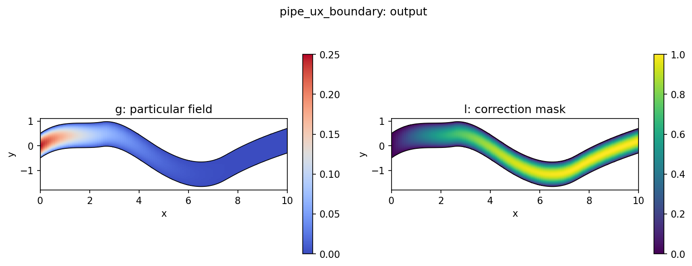

# PipeUxBoundaryAnsatz

`PipeUxBoundaryAnsatz` combines the parabolic inlet profile ([PipeInletParabolicAnsatz](PipeInletParabolicAnsatz.md)) and the no-slip wall
condition ([StructuredWallDirichletAnsatz](StructuredWallDirichletAnsatz.md)) into one smooth scalar $u_x$ constraint.

## Mechanism


The ansatz keeps the same inlet extension as `PipeInletParabolicAnsatz`, but multiplies the free component by both the inlet distance and the wall distance:

$$u = g + lN$$
where
$$g(i,j) = \alpha(i) U_{\max}4t(j)(1-t(j))$$
and
$$l(i,j) = (1-\alpha(i))l_{\text{wall}}(j), \qquad \alpha(i) = (1-\xi(i))^p$$

The wall distance $l_{\text{wall}}$ is zero on the lower and upper pipe walls,
while $1-\alpha$ is zero on the inlet. The constrained scalar output therefore
satisfies:

- inlet edge $i=0$: parabolic $u_x$ profile
- lower wall $j=0$: $u_x=0$
- upper wall $j=W-1$: $u_x=0$

The wall distance is built in index space, while the inlet profile is built from
decoded physical coordinates. That split matches the structure of the pipe
dataset and keeps the ansatz stable under coordinate normalization.

## Config

Shared constraint config:

[`configs/constraints/pipe_ux_boundary.yaml`](/Users/bruno/Documents/Y4/FYP/omni_hc/configs/constraints/pipe_ux_boundary.yaml)

```yaml
constraint:
  name: "pipe_ux_boundary"
  amplitude: 0.25
  inlet_axis: 0
  transverse_axis: 1
  coordinate_channel: 1
  inlet_decay_power: 4.0
  wall_distance_power: 1.0
  normalize_wall_distance: true
```

Pipe experiment using this constraint:

[`configs/experiments/pipe/fno_small_ux_boundary.yaml`](/Users/bruno/Documents/Y4/FYP/omni_hc/configs/experiments/pipe/fno_small_ux_boundary.yaml)

## Diagnostics And Tests

When `return_aux=True`, the constraint emits both inlet and wall diagnostics,
including:

- `constraint/inlet_abs_mean`
- `constraint/inlet_abs_max`
- `constraint/wall_abs_mean`
- `constraint/wall_abs_max`
- `constraint/boundary_distance_mean`
- `constraint/wall_distance_mean`

The tests verify exact inlet and wall enforcement, normalization support, and
the explicit $g+lN$ decomposition in
[`tests/test_boundary.py`](/Users/bruno/Documents/Y4/FYP/omni_hc/tests/test_boundary.py).
