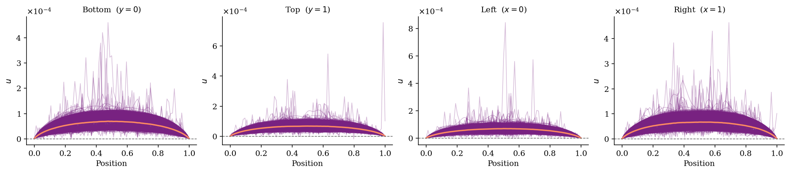
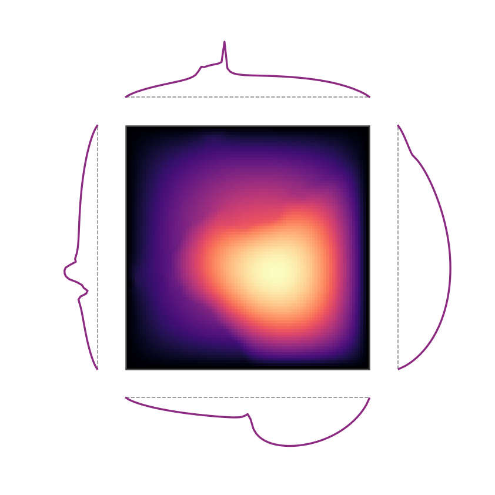

# SineBoundaryConstraint


|  |
| ----------------------------------------------------------------------------------- |
|   |

`SineBoundaryConstraint` hard-enforces the boundary values of a 2D prediction by
setting each edge to a **learned sine-basis expansion**. It is an instance of
the same additive ansatz $f = g + \ell \odot N$ used by the rest of the
Dirichlet family (`DirichletBoundaryAnsatz`, `StructuredWallDirichletAnsatz`,
…): the particular solution $g$ is the *learned* sine profile rather than a
fixed analytic one, and the distance $\ell$ is the **perimeter indicator**,
which is the special case of the ansatz that pins the boundary exactly while
leaving the interior to the backbone. This gives the model explicit control
over the boundary shape without the constraint being a separate mechanism.

## Motivation

Inspection of the Darcy pressure field reveals that the boundary values are not
exactly zero: they follow a smooth, sample-dependent arch driven by the local
permeability (see figures above). A constant Dirichlet ansatz with `g = 0`
misses this structure. The sine basis is the natural representation because it
satisfies zero-corner conditions by construction.

## Mechanism

For each of the four edges of an H × W grid, the constraint predicts a 1D
profile via a sine basis expansion:

$$
u(x_j) = \sum_{k=1}^{K} c_k \sin\!\left(\frac{k\pi j}{L - 1}\right), \quad j = 0, \ldots, L-1
$$

where $L$ is the edge length and $K$ is `n_modes`. Because $\sin(0) = \sin(k\pi) = 0$
for all integer $k$, the profile is **zero at both corners** by construction —
no special corner handling is needed.

The coefficient vectors $c_k \in \mathbb{R}^{4K}$ (one set per edge) are
predicted by a small MLP that takes as input the **permeability features**. The
default is the previous boundary-only input: $a(x)$ sampled at all boundary
nodes. For ablations, `feature_mode` can add one adjacent interior ring,
global/interior summary statistics, or the full permeability grid. This lets
the boundary-only assumption be tested directly instead of assumed.

Optionally, a latent representation from the backbone transformer can be wired
in via `ForwardHookLatentExtractor`. The latent is **mean-pooled over boundary
nodes only** before being concatenated to the permeability features, giving the
MLP a compact, boundary-aware summary of the model's internal state.

The predicted profiles are applied through the same additive boundary ansatz
used by the other Dirichlet constraints,

$$
f = g + \ell \odot N,
$$

where $N$ is the backbone prediction, $g$ is the **particular solution** (the
sine profiles placed on the perimeter nodes, zero in the interior), and $\ell$
is the **distance function**. Rather than being hard-written, the boundary is
expressed as a special case of this ansatz: choosing $\ell$ to be the
**perimeter indicator** — $\ell = 0$ on the boundary nodes and $\ell = 1$ in
the interior — collapses the ansatz to

$$
f = \begin{cases}
g & \text{on the boundary (} \ell = 0 \text{)} \\
N & \text{in the interior (} \ell = 1 \text{)}
\end{cases}
$$

so the boundary is set **exactly** to the predicted sine profile while the
interior is left as the backbone prediction. Swapping the indicator for a
smooth $\ell$ that vanishes on the boundary would instead blend the correction
inward, without any change to $g$ or the rest of the constraint.

### Why $g$ is built in physical space and then encoded

The sine basis is **zero-endpoint and zero-mean**: it can only represent a
corner-zero, DC-free profile. That assumption holds in *physical* space, where
the Darcy boundary is $\approx 0$. But predictions are trained in
**normalized** space, where that same boundary is a large near-constant
$-\mu/\sigma$ (physical $0 \mapsto (0-\mu)/\sigma$). A zero-mean sine series
**cannot** represent that constant — it can only Gibbs-ring around it, pinning
the corners to normalized-$0$, which *decodes to the field mean $\mu$* instead
of $0$.

The constraint therefore builds $g$ in **physical units** (where the sine
basis is valid) and applies the target normalizer before the ansatz, exactly
like the other Dirichlet constraints (`set_target_normalizer` /
`encode_target`). `encode_target` supplies the DC offset the basis cannot
produce. The encoded $g$ is then masked to the perimeter so the interior
particular is a hard $0$ (not $\mathrm{encode}(0) = -\mu/\sigma$), keeping the
interior exactly equal to $N$. When no normalizer is set, `encode_target` is
the identity and this reduces **bit-for-bit** to the original hard-overwrite.

```python
# g: sine profiles on the perimeter, zero interior — PHYSICAL units
g_phys = pred.new_zeros(B, H * W)
g_phys[:, idx_bottom] = coeffs[:, 0] @ basis_h.T   # [B, W]
g_phys[:, idx_top]    = coeffs[:, 1] @ basis_h.T
g_phys[:, idx_left]   = coeffs[:, 2] @ basis_v.T   # [B, H]
g_phys[:, idx_right]  = coeffs[:, 3] @ basis_v.T

# encode into prediction space, keep only the perimeter (interior stays exact N)
g_enc = encode_target(g_phys.unsqueeze(-1), target_normalizer)
particular = g_enc * boundary_keep                 # 1 on perimeter, 0 interior

# l = 0 on the perimeter, 1 in the interior  ->  f = encode(g) on boundary, N inside
out = apply_boundary_ansatz(
    pred=pred,
    particular=particular,
    distance=boundary_distance,        # perimeter indicator
    channel_mask=channel_mask(pred, [0]),
)
```

## Config

```yaml
constraint:
  name: "sine_boundary_constraint"
  n_modes: 16        # number of sine basis functions per edge
  hidden_dim: 128    # MLP hidden width
  n_layers: 2        # number of hidden layers (total depth = n_layers + 2)
  feature_mode: "boundary"
  act: "gelu"
```

Config file:
[`configs/constraints/darcy_sine_boundary_constraint.yaml`](../../../configs/constraints/darcy_sine_boundary_constraint.yaml)

To wire in a backbone latent (e.g. from a Transolver block), add:

```yaml
constraint:
  name: "sine_boundary_constraint"
  n_modes: 16
  hidden_dim: 128
  n_layers: 2
  latent_module: "blocks.-1"   # path to the module to hook
  latent_dim: 256              # output dimension of that module
```

## Parameters

| Parameter | Default | Description |
|---|---|---|
| `n_modes` | — | Number of sine basis functions per edge |
| `grid_shape` | from `shapelist` | `(H, W)` of the structured grid |
| `hidden_dim` | — | MLP hidden width |
| `n_layers` | `0` | Extra hidden layers (total MLP depth = `n_layers + 2`) |
| `act` | `"gelu"` | Activation function |
| `feature_mode` | `"boundary"` | Permeability features for the coefficient head: `boundary`, `boundary_inner`, `boundary_stats`, `boundary_inner_stats`, or `full` |
| `latent_dim` | `0` | Latent dimension to concatenate; `0` disables latent hook |
| `latent_module` | `None` | Dotted path to the backbone module to hook |

## Boundary-only search

The fastest way to tune this constraint is to train only the coefficient head
on boundary targets before running full backbone experiments. The default
diagnostic protocol trains on the first 1000 Darcy train samples and ranks
trials on the 200-sample Darcy test split:

```bash
conda run -n omni-hc python scripts/studies/darcy_sine_boundary_search.py \
  --search-method tpe \
  --max-trials 100 \
  --epochs 800 \
  --early-stopping-patience 100
```

This writes:

- `artifacts/darcy/darcy_sine_boundary_search/sine_boundary_search.csv`
- `artifacts/darcy/darcy_sine_boundary_search/best_sine_boundary_trial.yaml`

For a final checkpoint after selecting the search space, add `--save-best
outputs/darcy/coeff_head.pt` and copy the reported `recommended_constraint`
block into the experiment config.

## Diagnostics

When `return_aux=True` the constraint reports:

- `constraint/boundary_correction_mean_abs` — mean absolute difference between
  the predicted boundary profile and the unconstrained backbone output at boundary
  nodes. Useful for monitoring how much the constraint is actively correcting.

The `log_media` classmethod produces a 4-panel figure (one per edge) showing the
ground-truth boundary profile against the model prediction, uploaded to W&B as
`constraint/boundary_profiles`.

## Comparison with DirichletBoundaryAnsatz

| | `DirichletBoundaryAnsatz` | `SineBoundaryConstraint` |
|---|---|---|
| **Mechanism** | Multiplies backbone by distance weight $\ell(x)$ | Overwrites boundary nodes with a learned profile |
| **Boundary value** | Fixed constant $g$ | Predicted per-sample sine expansion |
| **Corner condition** | Exact (distance weight = 0) | Exact (sine basis vanishes at endpoints) |
| **Backbone at boundary** | Suppressed smoothly | Completely replaced |
| **Extra parameters** | None | MLP predicting sine coefficients |
| **Suitable when** | BC is known and constant | BC is unknown / varies per sample |
