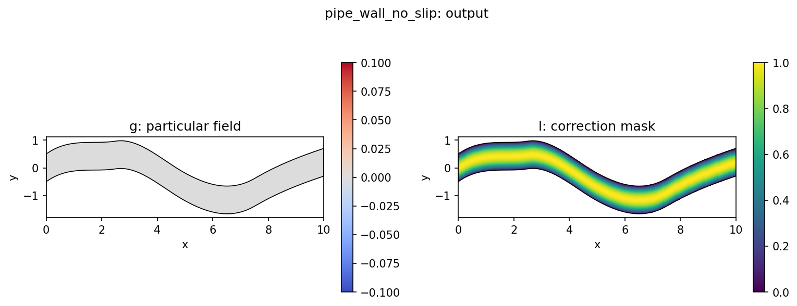

# StructuredWallDirichletAnsatz

`StructuredWallDirichletAnsatz` enforces a constant value on the two wall edges
of a structured 2D grid. For the [pipe benchmark](../../benchmarks/pipe.md),
those walls are the transverse-index edges $j=0$ and $j=W-1$.

## Mechanism



The constraint uses the standard hard-boundary ansatz:

$$
u = g + lN
$$

Here $N$ is the unconstrained model output, $g$ is the desired boundary value,
and $l$ is a distance-like field that is zero on the constrained boundary. On
the wall, $l=0$, so the prediction becomes exactly $u=g$ regardless of $N$.

For the pipe setup, the distance is built in structured index space rather than
from Cartesian coordinates:

$$
l(\eta) = \eta(1-\eta)
$$

where $\eta \in [0,1]$ is the normalized coordinate along the transverse grid
axis. With `normalize_distance: true`, the implementation uses
$4\eta(1-\eta)$ so that the maximum interior value is one. Because this distance
is index-based, it remains stable when the physical pipe geometry changes across
samples.

## Pipe Use Case

The current pipe benchmark predicts a single scalar target selected from
`Pipe_Q` through `data.target_channel`.

- `target_channel: 0` corresponds to $u_x$
- `target_channel: 1` corresponds to $u_y$
- `target_channel: 2` corresponds to $p$

This wall ansatz is appropriate for velocity channels because the inspected
dataset has zero wall velocity on $j=0$ and $j=W-1$. It should not be applied
unchanged to pressure, because the pressure channel is not a zero-wall target.

## Dataset Checks

Inspect the observed wall behavior with:

```bash
python scripts/diagnostics/pipe_boundary.py \
  --samples 0 10 100 \
  --summary-samples 1000
```

That script confirms that, over the training pipe dataset slice, wall $u_x$ and
wall $u_y$ are exactly zero on both transverse edges.

## Config

Shared constraint config:

[`configs/constraints/pipe_wall_no_slip.yaml`](/Users/bruno/Documents/Y4/FYP/omni_hc/configs/constraints/pipe_wall_no_slip.yaml)

```yaml
constraint:
  name: "pipe_wall_no_slip"
  boundary_value: 0.0
  transverse_axis: 1
  distance_power: 1.0
  normalize_distance: true
```

Pipe experiment using this constraint:

[`configs/experiments/pipe/fno_small_wall.yaml`](/Users/bruno/Documents/Y4/FYP/omni_hc/configs/experiments/pipe/fno_small_wall.yaml)

## Diagnostics And Tests

When `return_aux=True`, the constraint reports wall residual and mask behavior
through diagnostics such as:

- `constraint/wall_abs_mean`
- `constraint/wall_abs_max`
- `constraint/wall_distance_mean`
- `constraint/wall_base_abs_mean`
- `constraint/interior_abs_delta_mean`

Regression coverage lives in
[`tests/test_boundary.py`](/Users/bruno/Documents/Y4/FYP/omni_hc/tests/test_boundary.py).
