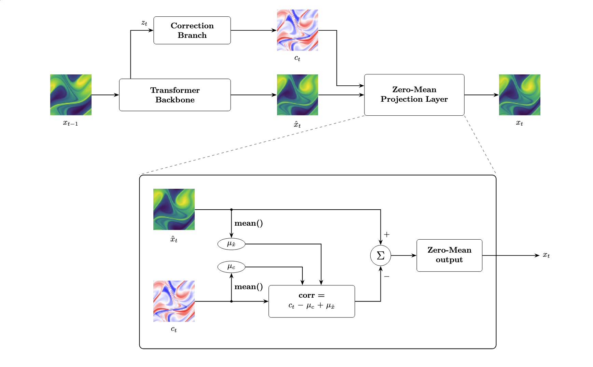

# MeanConstraint



The Navier-Stokes benchmark predicts vorticity on a periodic grid. In this
setting, the zero Fourier mode should stay fixed, so the spatial mean of the
predicted field should remain constant. OmniHC enforces that invariant with a
mean-correction wrapper in [src/omni_hc/constraints/mean.py](/Users/bruno/Documents/Y4/FYP/omni_hc/src/omni_hc/constraints/mean.py).

## Mechanism

The constraint subtracts a correction whose mean matches the mean of the base
prediction. That guarantees the corrected output has zero spatial mean.

```python
# pred: unconstrained backbone output
# corr_raw: learned or direct correction term
corr = corr_raw - corr_raw.mean(...) + pred.mean(...)
out = pred - corr
```

For the simplest mode, the correction is just the output mean itself:

```python
out = pred - pred.mean(...)
```

The implementation supports three modes:

- `post_output`: subtract the prediction mean directly.
- `post_output_learned`: learn a correction from the output tensor.
- `latent_head`: learn a correction from a captured latent representation.

The reusable config lives in
[`configs/constraints/mean_correction.yaml`](/Users/bruno/Documents/Y4/FYP/omni_hc/configs/constraints/mean_correction.yaml). Current Navier-Stokes experiment configs override that base config to use
`post_output`, which is the lightest version and does not require a latent hook.

## Configs
Navier-Stokes experiment configs that already include the mean constraint:
- [`configs/experiments/navier_stokes/fno_small_mean.yaml`](/Users/bruno/Documents/Y4/FYP/omni_hc/configs/experiments/navier_stokes/fno_small_mean.yaml)
- [`configs/experiments/navier_stokes/gt_small_mean.yaml`](/Users/bruno/Documents/Y4/FYP/omni_hc/configs/experiments/navier_stokes/gt_small_mean.yaml)

Those compose:
- benchmark defaults from
  [`configs/benchmarks/navier_stokes/base.yaml`](/Users/bruno/Documents/Y4/FYP/omni_hc/configs/benchmarks/navier_stokes/base.yaml)
- a backbone config from `configs/backbones/`
- the shared mean-constraint config from `configs/constraints/mean_correction.yaml`

Use the shared run commands from [../../README.md](../../README.md) with either
Navier-Stokes experiment config above.

## Results

Original results are taken from [here](https://arxiv.org/abs/2402.02366). Further hard constrained results to come, as compute is currently a bottleneck. 

| Model                            | Original Model Relative L2 | Hard Constrained Model Relative L2 |
| -------------------------------- | -------------------------- | ---------------------------------- |
| Galerkin Transformer (Cao, 2021) | 0.1401                     | 0.103730                           |
| GNOT (HAO ET AL., 2023)          | 0.1380                     |                                    |
| FACTFORMER (LI ET AL., 2023D)    | 0.1214                     |                                    |
| ONO (XIAO ET AL., 2024)          | 0.1195                     |                                    |
| TRANSOLVER (WU ET AL 2024)       | 0.0900                     |                                    |

## Tests

Regression coverage lives in
[`tests/test_mean.py`](/Users/bruno/Documents/Y4/FYP/omni_hc/tests/test_mean.py).
