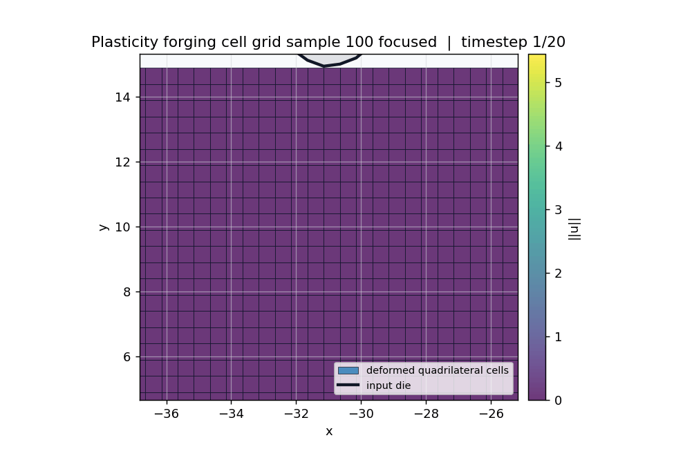
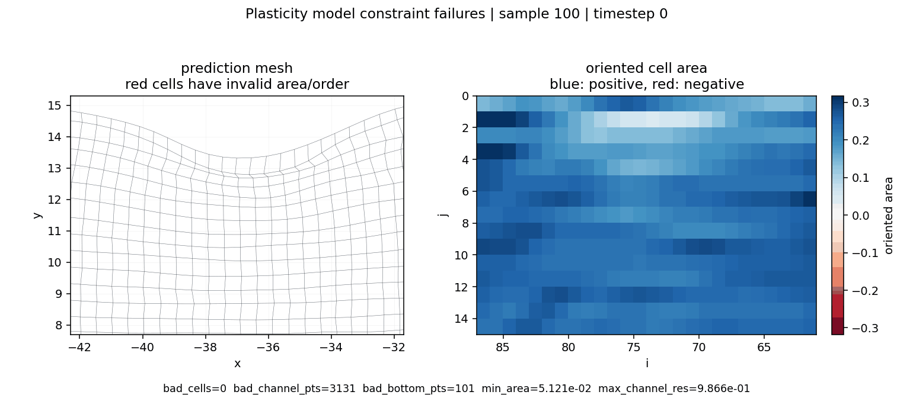

# PlasticityMeshConsistencyConstraint



The idea behind this constraint is that we can interpret the material as a mesh, where every point we evaluate at constitutes one of the coordinates of a quadrilateral cell. 
```
p00 --- p10           
 |       | 
 |       |      
p01 --- p11        

```

Looking closely at this cell, we see that it will always obey some intuitive properties:
- No cell foldover
- No cell inversion
- No cell collapse

In essence, this means that the material stays consistent and does not fold upon itself. If we look at the individual points we evaluate, point $p_{i,j}$ will always satisfy the following conditions
- If point $p_{i,j}$ started at the left/right of $p_{i+1,j}$ it will stay at the left/right of $p_{i+1,j}$ for all $t$
- If point $p_{i,j}$ started above/bellow of $p_{i,j+1}$ it will stay above/bellow of $p_{i,j+1}$ for all $t$

For example, an unconstrained model might do well in terms of data accuracy, but can struggle with these underlying principles



## Mechanism

The unconstrained backbone emits:

```text
pred: (batch, points, 3)
```

After reshaping to the structured grid `(I, J)`, those three channels are interpreted as:

- channel `0`: `x_anchor`, read on the `i=0` edge for every `j`
- channel `1`: raw positive spacing along the `i` direction
- channel `2`: raw positive spacing along the `j` direction

The raw spacing channels are mapped to positive spacings with either
`softplus` or `exp`, plus a small `min_spacing`:

```text
dx = positive(raw_dx) + min_spacing
dy = positive(raw_dy) + min_spacing
```

The shapes are:

```text
x_anchor: (batch, J)
dx:       (batch, I - 1, J)
dy:       (batch, I, J - 1)
```

The deformed coordinate grid is reconstructed by cumulative sums:

```text
x[:, 0, :]  = x_anchor
x[:, 1:, :] = x_anchor - cumsum(dx, dim=i)
```

and with a fixed lower boundary:

```text
y[:, :, J-1]  = y_bottom
y[:, :, :-1]  = y_bottom + reverse_cumsum(dy, dim=j)
```

This builds:

```text
coords = [x, y]: (batch, I, J, 2)
```

The displacement is not learned independently. It is defined from the fixed
material grid:

```text
u = coords - material_grid
```

The returned per-time-step prediction is:

```text
out = [x, y, u_x, u_y]: (batch, points, 4)
```

This keeps the benchmark target interface unchanged while forcing the
coordinate channels and displacement channels to describe the same deformation.

## What It Enforces

The constraint guarantees:

- positive spacing in the `i` and `j` directions
- a monotone ordered mesh under the configured orientation
- the lower `y` boundary fixed at `y_bottom`
- exact consistency between coordinates and displacement:

```text
[u_x, u_y] = [x, y] - [x_ref, y_ref]
```

 It is a geometric hard constraint for the deformation representation used by the benchmark.

## Config

Shared constraint config:

[`configs/constraints/plasticity_mesh_consistency_constraint.yaml`](../../../configs/constraints/plasticity_mesh_consistency_constraint.yaml)

```yaml
constraint:
  name: "plasticity_mesh_consistency_constraint"
  backbone_out_dim: 3
  target_out_dim: 4
  spacing_activation: "softplus"
  min_spacing: 1.0e-6
  x_left: 0.35000038
  x_right: -49.65
  y_top: 14.9
  y_bottom: -0.099999905
```

`backbone_out_dim: 3` changes the raw backbone output dimension from the
benchmark target dimension `4` to the latent spacing representation. The model
wrapper preserves the external task output dimension by applying the constraint before losses and metrics are computed.

`target_out_dim: 4` matches the plasticity target channels `[x, y, u_x, u_y]`.

The material-grid endpoints match the inferred Geo-FNO plasticity grid:

```text
x_ref = 0.35 - 0.5 * i
y_ref = 14.9 - 0.5 * j
```


## Diagnostics

When `return_aux=True`, the constraint reports:

- `constraint/min_dx`
- `constraint/min_dy`
- `constraint/min_oriented_cell_area`
- `constraint/bottom_y_abs_error_max`
- `constraint/axis_order_margin_min`

It also exposes auxiliary tensors:

- `pred_base`: raw three-channel backbone output
- `x_anchor`: the learned left-edge anchor values
- `dx`: positive spacing along the `i` direction
- `dy`: positive spacing along the `j` direction

The validation and test media use `dx`, `dy`, and the reconstructed cell areas
to produce the plasticity consistency panel.

## Tests

Regression coverage lives in:

- [`tests/test_plasticity_mesh_consistency.py`](../../../tests/test_plasticity_mesh_consistency.py)
- [`tests/test_constraint_config_wiring.py`](../../../tests/test_constraint_config_wiring.py)

Those tests check the reconstructed coordinates, hard lower-boundary behavior, positive spacing diagnostics, and config composition.
