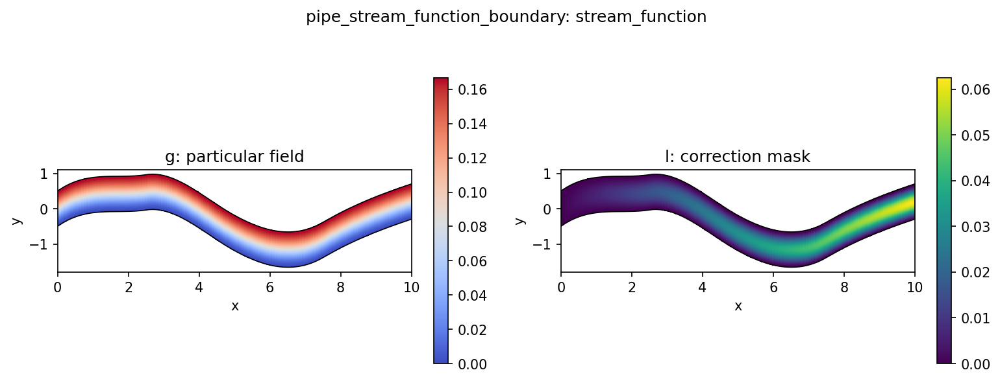

# PipeStreamFunctionBoundaryAnsatz

`PipeStreamFunctionBoundaryAnsatz` combines a divergence-free stream-function ([PipeStreamFunctionUxConstraint](PipeStreamFunctionUxConstraint.md)) representation with hard pipe boundary behavior ([PipeUxBoundaryAnsatz](PipeUxBoundaryAnsatz.md)).

## Mechanism


Instead of constraining $u_x$ directly, the method constrains the latent stream
function $\psi$:

$$\psi = \psi_{\text{bc}}(\eta) + m(\xi,\eta)N$$

Here $N$ is the unconstrained model output, $\xi$ is the normalized streamwise
coordinate, and $\eta$ is the normalized transverse coordinate. The boundary
stream function is:

To enforce the parabola on the $ux$ inlet (read more [here](../boundary/PipeInletParabolicAnsatz.md)) we have to take:
$$\psi_{\text{bc}}(\eta) = \int_0^1 u_{x,\text{inlet}}(\eta) \, d\eta + C$$

$$\psi_{\text{bc}}(\eta) = U_{\max}H\left(2\eta^2 - \frac{4}{3}\eta^3\right) + C$$

where $H$ is the physical inlet transverse extent and $U_{\max}$ is the
configured `amplitude=0.25` of the parabola. The key is that differentiating $\psi_{\text{bc}}$ recovers the parabolic inlet equation:

$$u_x(\eta) = U_{\max}4\eta(1-\eta)$$

We choose $C$ from the total inlet flux to fix the absolute stream-function level on the boundary:

$$C = \int_{\text{inlet}} u_x \, dy$$
which is the total area under the inlet $u_x$ parabola. 


The correction mask

$$m(\xi,\eta) = \xi^p\eta^2(1-\eta)^2$$

is zero on the inlet and on both walls, so the learned correction cannot alter
those boundary values. After building $\psi$, the constraint converts it to
physical velocity on the curvilinear pipe mesh and returns $u_x$.


## Diagnostics

Inspect representative outputs with:

```bash
python scripts/diagnostics/pipe_stream_function.py \
  --samples 0 10 100 \
  --summary-samples 1000
```

That diagnostic script visualizes the recovered $u_x$, the latent $\psi$, the
boundary stream function $\psi_{\text{bc}}$, and the correction mask.

## Config

Shared constraint config:

[`configs/constraints/pipe_stream_function_boundary.yaml`](/Users/bruno/Documents/Y4/FYP/omni_hc/configs/constraints/pipe_stream_function_boundary.yaml)

```yaml
constraint:
  name: "pipe_stream_function_boundary"
  amplitude: 0.25
  inlet_axis: 0
  transverse_axis: 1
  boundary_constant: 0.0
  coordinate_channel: 1
  decay_power: 1.0
  eps: 1.0e-12
```

Pipe experiment using this constraint:

[`configs/experiments/pipe/fno_small_stream_boundary.yaml`](/Users/bruno/Documents/Y4/FYP/omni_hc/configs/experiments/pipe/fno_small_stream_boundary.yaml)

## Diagnostics And Tests

When `return_aux=True`, the constraint reports both divergence and boundary
quality:

- `constraint/stream_div_abs_mean`
- `constraint/stream_inlet_abs_mean`
- `constraint/stream_inlet_abs_max`
- `constraint/stream_wall_ux_abs_mean`
- `constraint/stream_wall_ux_abs_max`
- `constraint/stream_mask_mean`

and exposes auxiliary outputs including `stream_psi`, `stream_div`,
`stream_psi_bc`, and `stream_mask`.

Regression coverage in
[`tests/test_stream.py`](/Users/bruno/Documents/Y4/FYP/omni_hc/tests/test_stream.py)
checks that the correction mask is zero on the inlet and walls, and that the
diagnostics for divergence, inlet residual, and wall residual are emitted.
