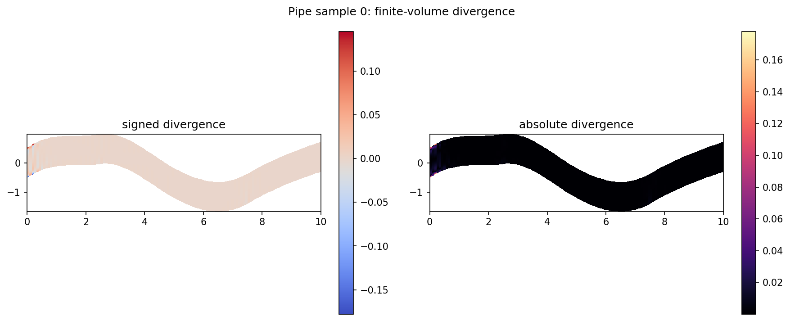
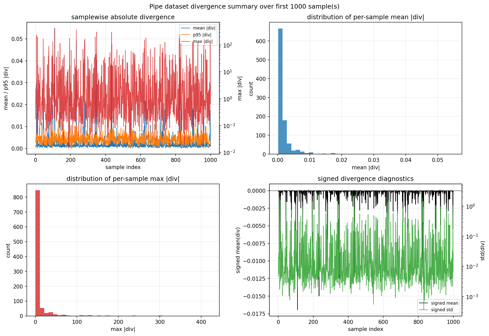

# PipeStreamFunctionUxConstraint

`PipeStreamFunctionUxConstraint` interprets the scalar backbone output as a
stream function $\psi$ on the curvilinear pipe mesh and recovers the physical
velocity field from that latent representation.

## Mechanism



The backbone predicts a scalar stream function $\psi$. The constraint reshapes
it onto the pipe grid, differentiates it in physical coordinates, and returns
only the $u_x$ component:

$$\psi \mapsto \mathbf{u} = (u_x, u_y)$$

$$u_x = \frac{\partial \psi}{\partial y}, \qquad u_y = -\frac{\partial \psi}{\partial x}$$

This construction makes the recovered velocity divergence-free in the continuous
setting:

$$\nabla \cdot \mathbf{u} = \frac{\partial u_x}{\partial x} + \frac{\partial u_y}{\partial y} = \frac{\partial^2 \psi}{\partial x \partial y} - \frac{\partial^2 \psi}{\partial y \partial x} = 0$$

The implementation computes the derivatives on the curvilinear pipe mesh using
[`src/omni_hc/constraints/utils/stream_ops.py`](/Users/bruno/Documents/Y4/FYP/omni_hc/src/omni_hc/constraints/utils/stream_ops.py).

This is not a boundary ansatz. It enforces incompressibility structurally by
recovering velocity from $\psi$, but it does not directly force the pipe inlet
profile or wall values.

The dataset-level divergence diagnostic is summarized in:



The nonzero values in that plot are to be expected. These come from the fact that the zero-divergence is a continuous statement:
$$\nabla \cdot (\partial_y \psi, -\partial_x \psi) = 0$$
ad in the implementation, we only have $\psi$ on a discrete curvilinear grid. The constraint recovers velocity with discrete finite-difference derivatives over the sampled
field, divergence is measured via a separate finite-volume operator. On a mesh with finite spacing, a sampled $\psi$ is only an approximation to a continuous field, and the finite-difference and finite-volume operations are not exact. That leaves a small numerical divergence, especially around curved areas or where the field changes rapidly relative to the grid resolution.

## Config

Shared constraint config:

[`configs/constraints/pipe_stream_function.yaml`](/Users/bruno/Documents/Y4/FYP/omni_hc/configs/constraints/pipe_stream_function.yaml)

```yaml
constraint:
  name: "pipe_stream_function_ux"
  eps: 1.0e-12
```

Pipe experiment using this constraint:

[`configs/experiments/pipe/fno_small_stream.yaml`](/Users/bruno/Documents/Y4/FYP/omni_hc/configs/experiments/pipe/fno_small_stream.yaml)

## Diagnostics And Tests

When `return_aux=True`, the constraint reports:

- `constraint/stream_div_abs_mean`
- `constraint/stream_div_abs_max`
- `constraint/stream_uy_abs_mean`
- `constraint/stream_jac_min`
- `constraint/stream_psi_std`

and auxiliary tensors including `stream_psi`, `stream_uy`, and `stream_div`.

Regression coverage in
[`tests/test_stream.py`](/Users/bruno/Documents/Y4/FYP/omni_hc/tests/test_stream.py)
checks that:

- $u_x$ is recovered correctly from a known stream function
- normalized inputs and targets are handled correctly
- the emitted divergence diagnostics are present
